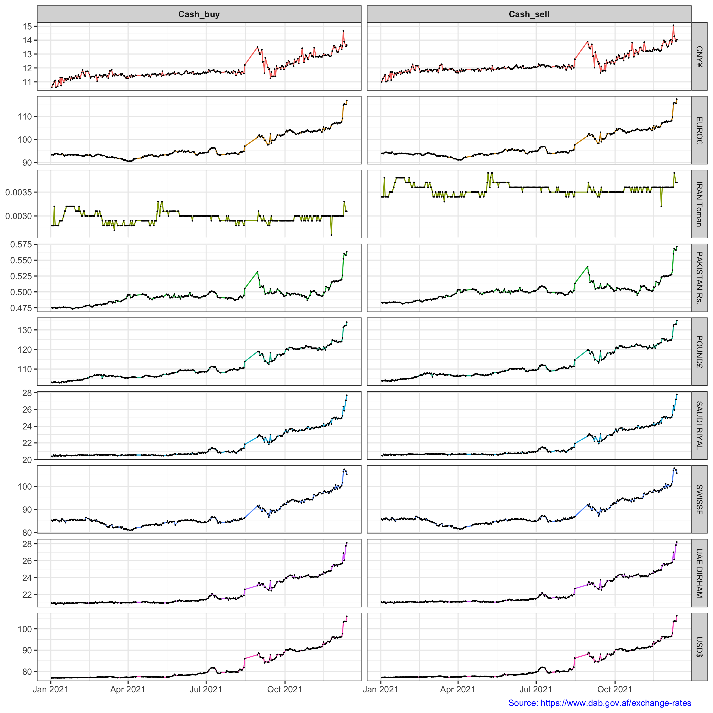

# Scraping html tables into R data frames

### Loading required packages

```r
library(rvest)  
library(tidyverse)
```

### Set the start and end dates 
```r
start <- as.Date("01-01-2020",format="%m-%d-%y")  
end   <- as.Date("12-31-2020",format="%m-%d-%y")  
final_data <- rbind()  
```

### Scraping the data from "https://www.dab.gov.af/exchange-rates"  
```r
while (start <= end){  
  
  print(paste0("Extracting table from https://www.dab.gov.af/exchange-rates?field_date_value=",format(start,"%m/%d/%y")))  
  df <- read_html(paste0("https://www.dab.gov.af/exchange-rates?field_date_value=",format(start,"%m/%d/%y")))  
  logic <- html_nodes(df, xpath = "/html/body/div[1]/main/section/div/div/div/div[2]/table") %>% html_table() %>% unlist()  
    
  if (!is.null(logic)) {  
    df_final <- html_nodes(df, xpath = "/html/body/div[1]/main/section/div/div/div/div[2]/table") %>% html_table() %>% data.frame() %>%  mutate(date = start)  
  }  
    
  final_data <- rbind(final_data, df_final)  
  start <- start + 1                      
}  
```
### Plotting the data
```r
final_data %>%   
  filter(Currency %in% c("CNY¥", "EURO€", "INDIAN Rs.", "IRAN Toman", "PAKISTAN Rs.", "POUND£", "SAUDI RIYAL", "SWISS₣", "UAE DIRHAM", "USD$")) %>%   
  mutate(  
    Cash_sell = as.numeric(Cash..Sell.),  
    Cash_buy = as.numeric(Cash..Buy.)  
    ) %>%   
  select(Currency, date, contains("Cash_")) %>%   
  pivot_longer(-c("Currency", "date"), names_to = "names", values_to = "values") %>%   
  filter(!is.na(values)) %>%   
  ggplot(aes(x = date, y = values, color = Currency)) +  
  geom_line(show.legend = F) +  
  geom_point(show.legend = F, size = 0.1, color = "black") +  
  facet_grid(Currency~names, scales = "free_y") +  
  theme_bw() +  
  theme(strip.text.x = element_text(face = "bold"),  
        strip.text.y = element_text(size = 8),  
        plot.caption = element_text(color = "blue")  
        ) +  
  labs(x = NULL, y = NULL, caption = "Source: https://www.dab.gov.af/exchange-rates")  
  ```


    
